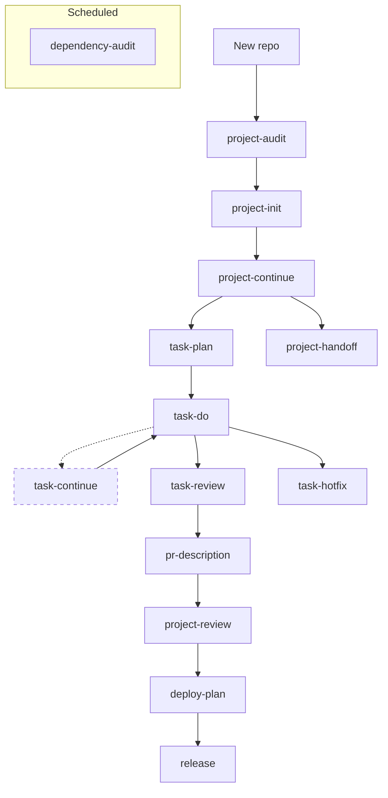

# dev-workflows

Structured prompts for every stage of AI-assisted development. Install once, invoke from any AI coding agent via `/dev-workflows:skill-name`.

## Problem

An agent without structured context improvises: reads files at random, skips conventions, mixes planning with implementation, leaves inconsistent traces between sessions. These prompts enforce a reproducible sequence — orientation → documentation → work — across any AI tool you use.

## Quick Install

```bash
# Interactive — choose tools and scope
uv run install.py

# Or remotely (no clone needed)
uv run https://raw.githubusercontent.com/fnhernandorena/agents_prompts/main/install.py
```

Requires [uv](https://docs.astral.sh/uv/). Supports Claude Code, Codex, Cursor, Gemini CLI, OpenCode, and **Hermes Agent**. Installs globally (active in all projects) or locally (this project only).

---

## Skills

### Workflows — multi-repo workspaces

| Skill | Invoke | When to use |
|-------|--------|-------------|
| `workflow-init` | `/dev-workflows:workflow-init` | First session in a workspace with multiple repos |
| `workflow-continue` | `/dev-workflows:workflow-continue` | Resume an existing workspace session |
| `workflow-add-repo` | `/dev-workflows:workflow-add-repo` | Add a new repo to an existing workspace |
| `workflow-status` | `/dev-workflows:workflow-status` | Workspace visibility: branches, tasks, CI, uncommitted changes |

### Projects — single repos

| Skill | Invoke | When to use |
|-------|--------|-------------|
| `project-init` | `/dev-workflows:project-init` | First time an agent works in a repo — builds `.context8/` |
| `project-continue` | `/dev-workflows:project-continue` | Start of every session in a documented repo |
| `project-handoff` | `/dev-workflows:project-handoff` | End a session cleanly for the next agent |
| `project-audit` | `/dev-workflows:project-audit` | Joining a project with no or stale documentation |
| `project-review` | `/dev-workflows:project-review` | Full project health check before milestones |

### Tasks

| Skill | Invoke | When to use |
|-------|--------|-------------|
| `task-plan` | `/dev-workflows:task-plan` | Before any complex implementation — plan phases, risks, file list |
| `task-do` | `/dev-workflows:task-do` | Implement a planned task step by step |
| **`task-continue`** | **`/dev-workflows:task-continue`** | **Resume a partially completed task** |
| `task-review` | `/dev-workflows:task-review` | Pre-PR code review (correctness, security, tests) |
| `task-hotfix` | `/dev-workflows:task-hotfix` | Urgent production fix with controlled speed |

### Analysis

| Skill | Invoke | When to use |
|-------|--------|-------------|
| `change-impact` | `/dev-workflows:change-impact` | Analyze blast radius of a proposed change |
| `dependency-audit` | `/dev-workflows:dependency-audit` | Audit deps: vulnerabilities, outdated packages, unused |

### Pull Requests

| Skill | Invoke | When to use |
|-------|--------|-------------|
| `pr-description` | `/dev-workflows:pr-description` | Generate structured PR description from the current diff |

### Deployments

| Skill | Invoke | When to use |
|-------|--------|-------------|
| `deploy-plan` | `/dev-workflows:deploy-plan` | Plan deployment with rollback and verification |
| `release` | `/dev-workflows:release` | End-to-end release: version bump, changelog, tag, publish |

### Agent Generators

| Skill | Invoke | When to use |
|-------|--------|-------------|
| `create-qa-agent` | `/dev-workflows:create-qa-agent` | Need a specialized QA/testing agent prompt |
| `create-architect-agent` | `/dev-workflows:create-architect-agent` | Need a software architect agent prompt |
| `create-backend-agent` | `/dev-workflows:create-backend-agent` | Need a backend development agent prompt |
| `create-frontend-agent` | `/dev-workflows:create-frontend-agent` | Need a frontend development agent prompt |
| `create-database-agent` | `/dev-workflows:create-database-agent` | Need a database expert agent prompt |
| `create-cloud-agent` | `/dev-workflows:create-cloud-agent` | Need a cloud architect agent prompt |
| `create-devops-agent` | `/dev-workflows:create-devops-agent` | Need a DevOps/SRE agent prompt |
| `create-security-agent` | `/dev-workflows:create-security-agent` | Need a security engineer agent prompt |
| `create-mobile-agent` | `/dev-workflows:create-mobile-agent` | Need a mobile developer agent prompt (iOS, Android, React Native, Flutter) |

---

## Typical Flow



### Simplified linear flow
```
project-audit → project-init → project-continue → task-plan → task-do
       ↓                                                      ↓    ↓
  project-review ← pr-description ← task-review ← task-hotfix     task-continue
       ↓
  deploy-plan → release
```
```
project-handoff (end of session)
```

For workspaces with multiple repos:
```
workflow-init → workflow-continue (each session) → workflow-add-repo → workflow-status
```

---

## What Each Skill Produces

- `workflow-init` → `.context8/WORKSPACE_OVERVIEW.md` + per-repo `.context8/WORKSPACE_LINK.md`
- `workflow-continue` → session restored, task files or `.context8/WORKSPACE_STATUS.md` refreshed
- `workflow-add-repo` → `.context8/WORKSPACE_LINK.md` for new repo + install/clone summary
- `workflow-status` → workspace status report printed inline or saved to `.context8/WORKSPACE_STATUS.md`
- `project-init` → `.context8/` with `AGENT_CONTEXT.md`, architecture docs, module map
- `project-continue` → task file in `.context8/tasks/YYYY-MM-DD_*.md`
- `project-handoff` → `.context8/HANDOFF_YYYY-MM-DD.md` with state, decisions, next steps
- `project-audit` → `.context8/AUDIT_YYYY-MM-DD.md` across 7 dimensions
- `project-review` → `.context8/reports/PROJECT_REVIEW.md` with architecture, security, deps, tests, tech debt
- `task-plan` → task file with acceptance criteria, step-by-step plan, risk table
- `task-do` → implementation + updated task file with completion status
- `task-continue` → task file with resumption timestamp, phase progress updated, execution resumed from interruption point
- `task-review` → review report: verdict READY FOR PR or BLOCKED with reasons
- `task-hotfix` → hotfix task file with root cause, fix, and blast radius
- `change-impact` → impact analysis report printed inline
- `dependency-audit` → `.context8/reports/DEPENDENCY_AUDIT.md` with vulns, outdated deps, upgrade plan
- `pr-description` → structured PR description markdown printed inline
- `deploy-plan` → deploy plan saved to `.context8/deploy-plans/YYYY-MM-DD_*.md`
- `release` → version bump, CHANGELOG.md updated, git tag, `.context8/releases/vX.Y.Z.md`
- Generator skills (create-*) → agent file in the native format of the current tool

---

## Installation Details

The installer (`install.py`) is a single Python file with no external dependencies. It:

1. Detects which AI tools you have installed
2. Lets you pick which ones to install for
3. Lets you pick scope: global (agent's user config, all projects) or project-local
4. Copies `SKILL.md` + `prompt.md` for each skill into the right directory

**Global install paths:**
| Tool | Path |
|------|------|
| Claude Code | `~/.claude/skills/` |
| Codex | `~/.agents/skills/` |
| Cursor | `~/.cursor/skills/` |
| Gemini CLI | `~/.gemini/GEMINI.md` |
| OpenCode | `~/.config/opencode/AGENTS.md` |
| **Hermes Agent** | **`~/.hermes/skills/dev-workflows/`** |

**Project-local paths:** `.claude/skills/`, `.agents/skills/`, `.cursor/skills/`, `./GEMINI.md`, `./AGENTS.md`

```bash
uv run install.py             # interactive
uv run install.py --dry-run   # preview, no writes
uv run install.py --uninstall # remove
```

---

## Agent Documentation

This project uses a structured documentation system in `.context8/`.
See [`.context8/README.md`](.context8/README.md) for the full index.

When working with an AI agent, use `.context8/AGENT_SYSTEM_PROMPT.md`
as the system prompt and `.context8/AGENT_CONTEXT.md` as the primary reference.

---

## Repository Structure

```
agents_prompts/
├── install.py                    # Cross-platform installer
├── CLAUDE.md                     # Plugin context for Claude Code
├── GEMINI.md                     # Plugin context for Gemini CLI
├── gemini-extension.json         # Gemini extension manifest
│
├── workflows/                    # Source prompts — multi-repo
│   ├── init.md
│   ├── continue.md
│   └── add-repo.md
│
├── projects/                     # Source prompts — single repo
│   ├── init.md
│   ├── continue.md
│   ├── handoff.md
│   └── audit.md
│
├── tasks/                        # Source prompts — task execution
│   ├── plan.md
│   ├── do.md
│   ├── review.md
│   └── hotfix.md
│
└── skills/                       # Packaged skills (installed by install.py)
    ├── workflow-init/
    │   ├── SKILL.md              # Frontmatter + when to use + @prompt.md
    │   └── prompt.md             # Full prompt content
    ├── workflow-continue/
    ├── workflow-add-repo/
    ├── project-init/
    ├── project-continue/
    ├── project-handoff/
    ├── project-audit/
    ├── task-plan/
    ├── task-do/
    ├── task-review/
    └── task-hotfix/
```

---

## Rules

- Every skill enforces phases. Do not skip phases, even for "simple" tasks.
- Skills produce files (`.context8/`, task files, handoff summaries). Output goes to disk, not inline.
- All documentation written in English unless explicitly overridden.
- `project-review` blocks PR or milestone if any critical security issue is unresolved.
- `task-hotfix` rule: if the fix requires more than 20 lines changed, pause and consider a targeted mitigation instead.
